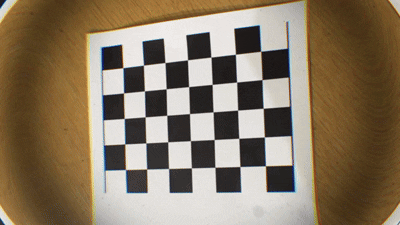

# Camera Calibration & Distortion Correction

체스보드 영상을 이용해 카메라를 자동으로 캘리브레이션하고, 왜곡 보정 영상을 저장합니다.

## 출력 영상 (왜곡 보정 후)


## 동작 순서

1. **프레임 자동 선택** — 영상 전체를 탐색하며 선명하고 다양한 체스보드 프레임을 자동으로 최대 20장 선택
2. **캘리브레이션** — 선택된 프레임으로 카메라 내부 파라미터(fx, fy, cx, cy) 및 왜곡 계수 계산
3. **왜곡 보정 영상 저장** — 전체 영상에 보정을 적용해 MP4로 저장, 원본/보정본 나란히 미리보기 제공

## 설정

[`chesscalib.py`](chesscalib%20.py) 상단의 상수를 수정하세요.

| 변수 | 기본값 | 설명 |
|------|--------|------|
| `VIDEO_FILE` | `video_calibration.mp4` | 입력 영상 경로 |
| `OUTPUT_FILE` | `video_rectified.mp4` | 출력 영상 경로 |
| `BOARD_PATTERN` | `(7, 5)` | 체스보드 내부 코너 수 (열, 행) |
| `BOARD_CELLSIZE` | `0.025` | 체스보드 한 칸의 실제 크기 (단위: m) |

## 출력 결과

```
선명도 기준: 142.3 (샘플 중앙값: 210.5)
총 1800프레임 자동 탐색 중...
  프레임 87 선택 (선명도=318, 총 1장)
  ...

## Camera Calibration Results
* 사용된 이미지 수 = 15
* RMS error (rmse) = 0.312
* fx = 1423.5820
* fy = 1421.3041
* cx = 960.1234
* cy = 540.8765
* Distortion coefficients (k1, k2, p1, p2, k3) = [...]
* FOV: Horizontal=62.3°, Vertical=36.8°
```
